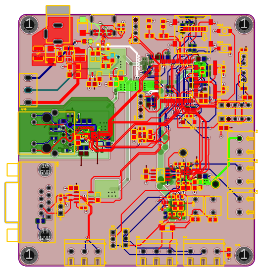
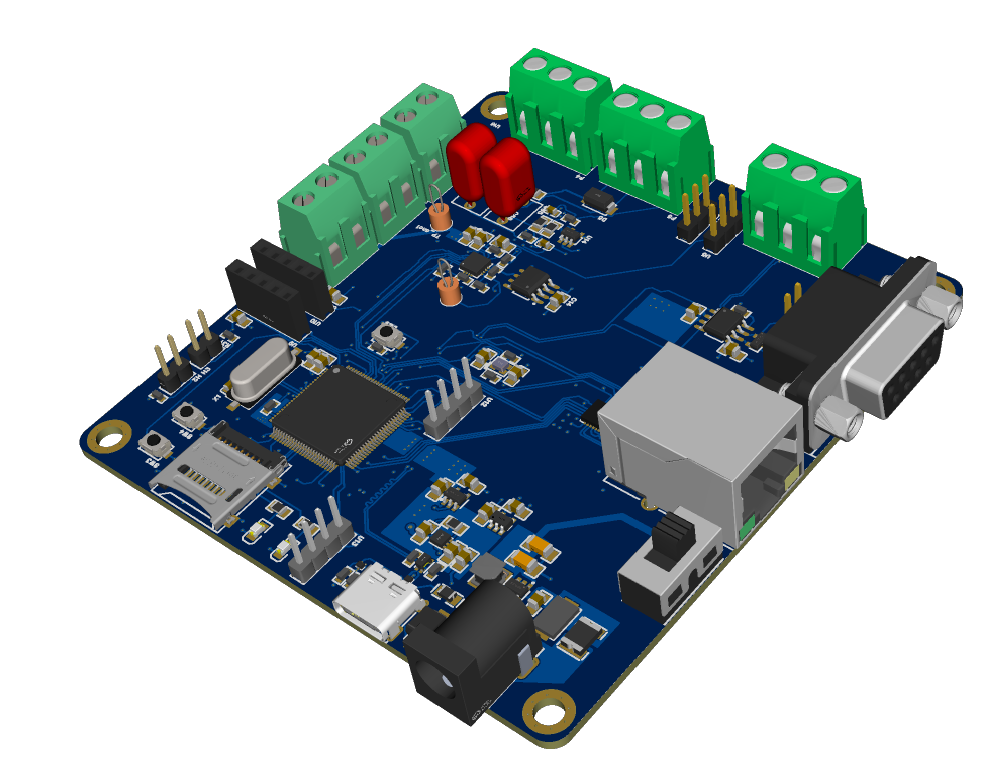

# Precision ADC / Mixed-Signal Acquisition Board
> **Architecture, Analogue Integrity, and High-Speed Interface Case Study**

## 📋 Overview
This project is a high-precision embedded node designed for industrial data acquisition. It integrates a ΔΣ (Delta-Sigma) acquisition chain with high-speed communication interfaces (Ethernet/CAN), requiring a strict 4-layer PCB strategy to maintain signal integrity and a low noise floor.

---

## 🛠️ System Specifications
| Feature | Implementation |
| :--- | :--- |
| **ADC** | ΔΣ Architecture (ADS1220) via SPI |
| **Reference** | Precision 2.5V Low-Drift (REF5025) |
| **Networking** | 100BASE-TX Ethernet (Controlled Impedance) |
| **Field Bus** | CAN Transceiver with ESD/TVS Protection |
| **Power** | Dual Input (USB 5V / DC Jack) with Auto-ORing |
| **PCB** | 4-Layer Stack-up with dedicated Ground Planes |

---

## 📐 Hardware Architecture

### 1. Precision Analogue Chain
The mixed-signal stage is designed to maximize the Dynamic Range of the ADC. 
* **Analogue Island:** Implementation of a dedicated analogue ground region to control return paths and prevent digital switching noise from coupling into the sensitive frontend.
* **Conditioning:** Front-end features input protection and multi-stage anti-alias RC filtering.
* **Reference Integrity:** The 2.5V reference is treated as a critical node with local star-grounding and Kelvin-point decoupling.

### 2. Power Management & Protection
The board features a robust power front-end designed for industrial environments.
* **Dual-Source OR-ing:** Seamless switching between USB and DC Jack without back-feeding sources.
* **Protection:** Integrated TVS diodes for transient suppression and inrush current limiting.
* **Rail Isolation:** LDO-regulated analogue rails to provide a "quiet" supply for the ADC, physically separated from high-current digital switching loads.

### 3. High-Speed Communication (Ethernet & CAN)
* **Ethernet (100BASE-TX):** PHY-to-Magnetics routing treated as a 100Ω differential transmission line problem. Managed via intra-pair length matching and strictly continuous reference planes (no plane splits under diff-pairs).
* **CAN Bus:** Designed for real-world robustness with 120Ω selectable termination and ESD protection placed immediately at the connector interface.

---

## 🚀 Key Design Decisions
* **Controlled Impedance:** Trace widths and spacings were calculated based on the PCB stack-up to meet 50Ω single-ended and 100Ω differential targets.
* **Return Path Management:** Avoided crossing gaps in reference planes to prevent EMI issues and signal distortion on fast edges (Ethernet/SPI).
* **Component Placement:** Grouped functional blocks (Analogue, Digital, Power) to minimize cross-talk and simplify the grounding strategy.

---

## 🧪 Validation & Testing
To ensure the design met the initial specifications, the following validation steps were performed:
1. **Rail Noise Analysis:** Measuring VCC_Analogue ripple under heavy Ethernet/CPU activity.
2. **Noise Floor Check:** Shorted-input test to determine the effective resolution (ENOB) of the ADC.
3. **Signal Quality:** Oscilloscope verification of Ethernet differential eye diagrams and SPI clock edges.
